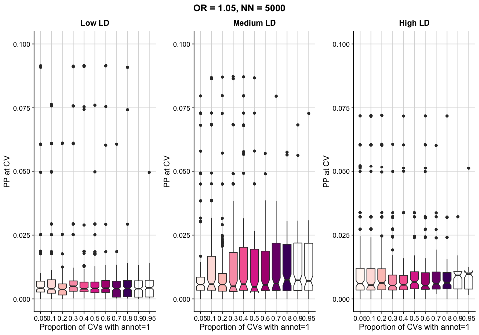
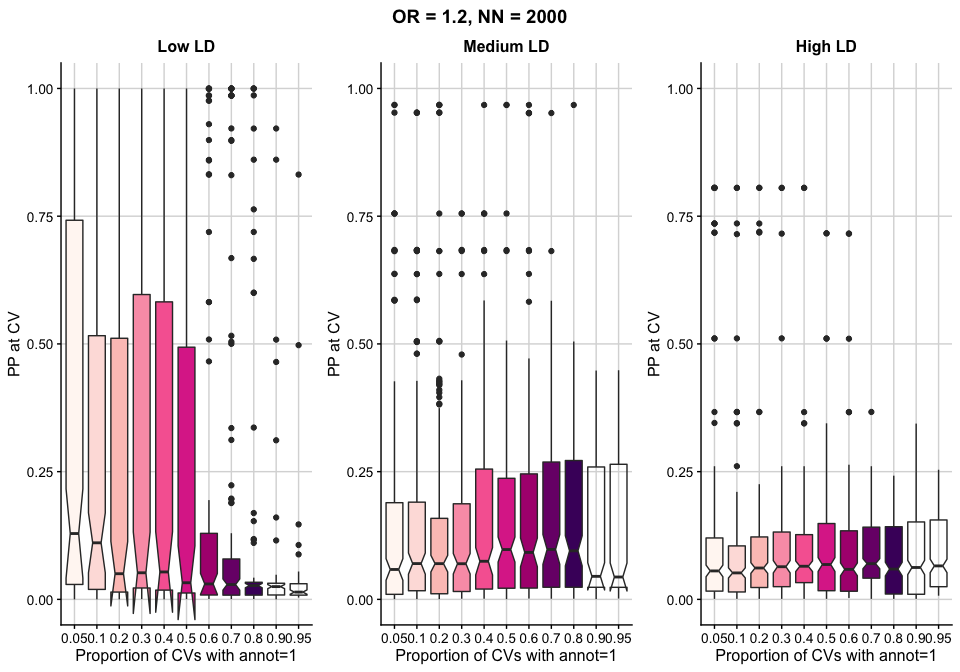
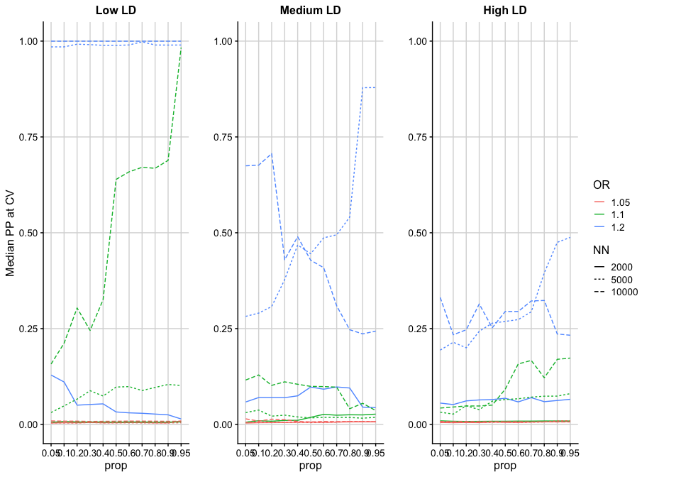
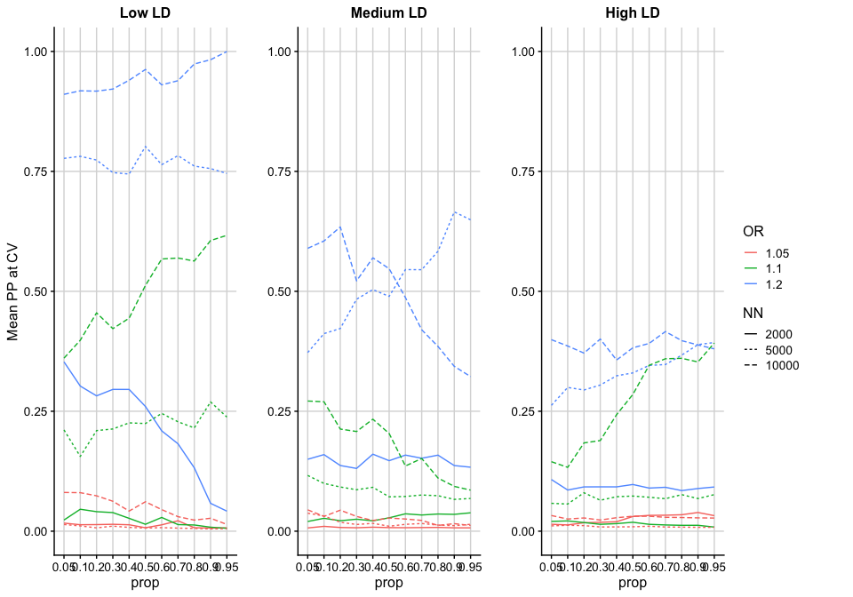
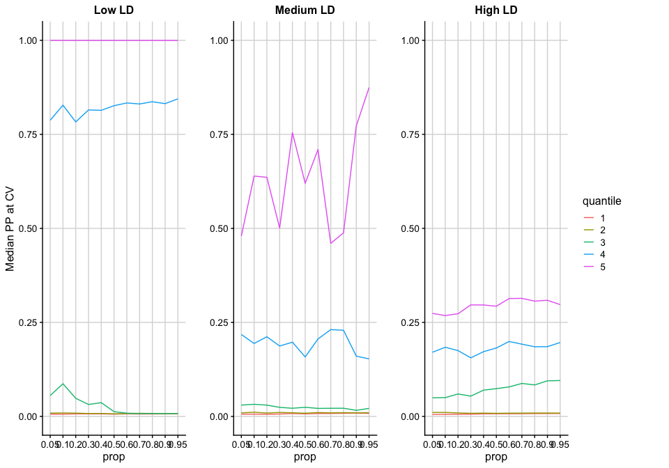
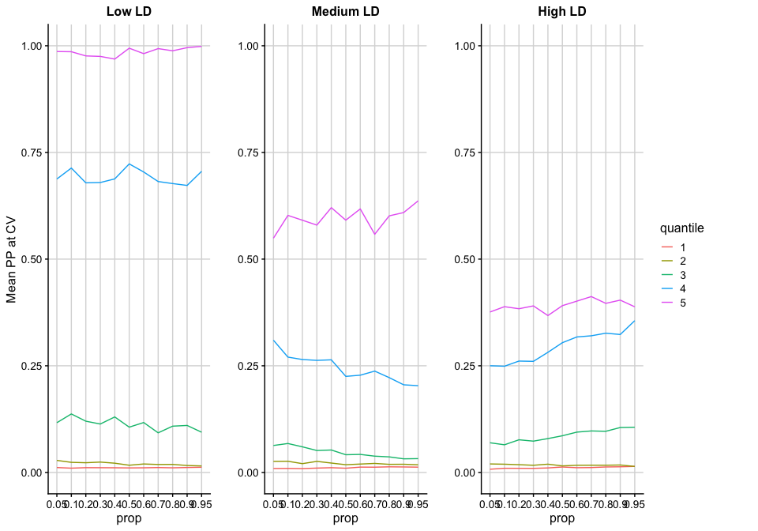

------------------------------------------------------------------------

### Aim

------------------------------------------------------------------------

Investigate how useful incorporating functional annotation data is for
fine-mapping causal variants using PAINTOR.

------------------------------------------------------------------------

### Method

------------------------------------------------------------------------

Z score vectors from GWASs that vary in (i) LD of the region, (ii) OR at
the CV (1.05, 1.1, 1.2) and (iii) sample sizes (2K, 5K or 10K cases and
controls) are simulated. Corresponding binary annotation vectors are
also simulated, whereby the annotation mark is randomly present (=1) in
5% of the SNPs in each simulation.

PAINTOR is run on various combinations of the simulated loci and the
proportion of CVs with the annotation present (=1) is recorded. The
annotation is uninformative in combinations where the annotation is
present in 5% of the CVs (as this is its proportion genome-wide) and
becomes more informative as the number of CVs with the annotation
present (=1) increases in that specific combination of simulated loci.

------------------------------------------------------------------------

### Code

------------------------------------------------------------------------

The code to run this analysis is avaliable in the /code directory of
this github repository. The files should be run in the following order:

1.  `simulate_loci.R`

2.  `make_loci_combinations.R`

3.  `run_PAINTOR`

4.  `make_finalres.R`

------------------------------------------------------------------------

### Results

------------------------------------------------------------------------

------------------------------------------------------------------------

------------------------------------------------------------------------

------------------------------------------------------------------------

------------------------------------------------------------------------

#### Quantiles of maximum absolute Z score in the region

------------------------------------------------------------------------

------------------------------------------------------------------------

------------------------------------------------------------------------
