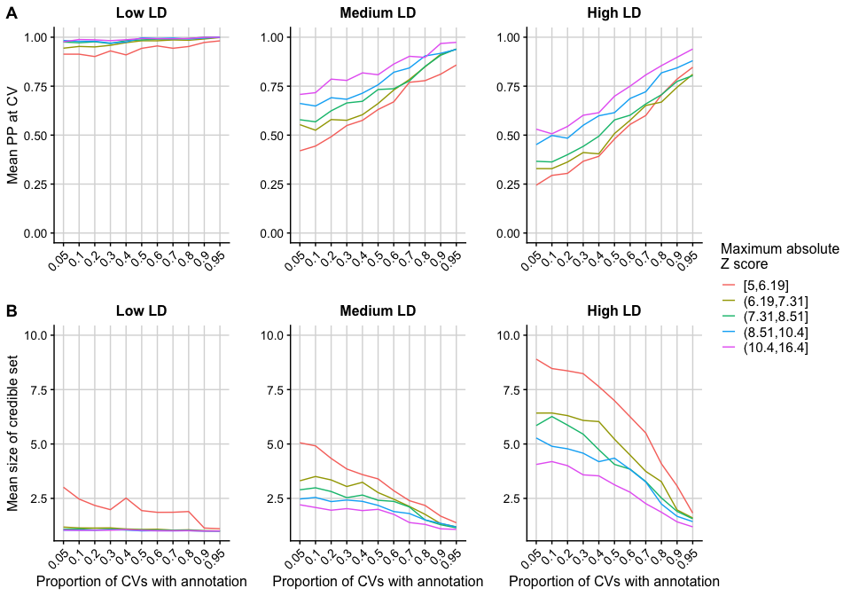

------------------------------------------------------------------------

### Aim

------------------------------------------------------------------------

Investigate the utility of incorporating functional annotation data for
fine-mapping causal variants using PAINTOR.

------------------------------------------------------------------------

### Method

------------------------------------------------------------------------

Simulate loci that reach genome-wide significance and corresponding
binary annotation vectors, where 5% of the SNPs are randomly allocated
the annotation.

Run PAINTOR on various combinations of the simulated loci, where the
proportion of CVs with the annotation varies across combinations. The
annotation is uninformative in combinations where the annotation is
present in 5% of the CVs (as this is its proportion genome-wide) and
becomes more informative as the number of CVs with the annotation
increases in that specific combination of simulated loci.

------------------------------------------------------------------------

### Code

------------------------------------------------------------------------

The code to run this analysis is avaliable in the /code directory of
this github repository. The files should be run in the following order:

1.  `simulate_loci.R`

2.  `make_loci_combinations.R`

3.  `run_PAINTOR`

4.  `make_finalres.R`

------------------------------------------------------------------------

### Results

------------------------------------------------------------------------

------------------------------------------------------------------------
